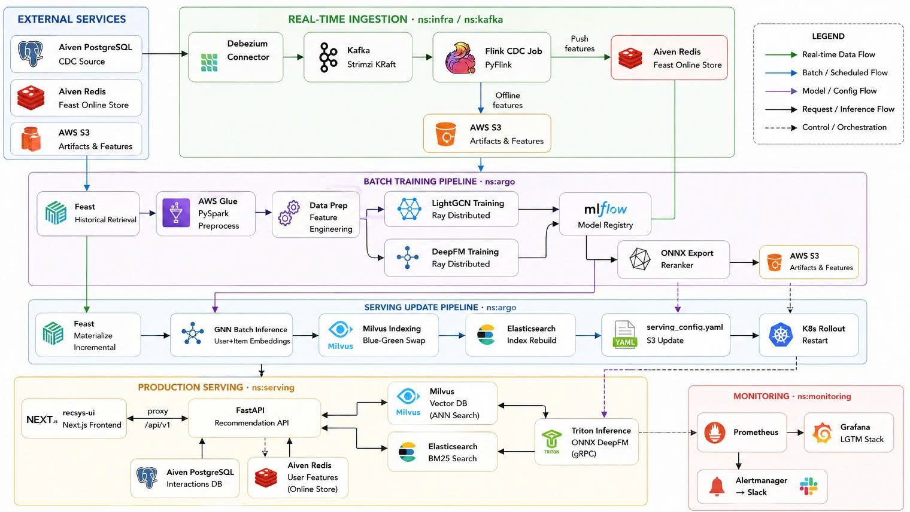
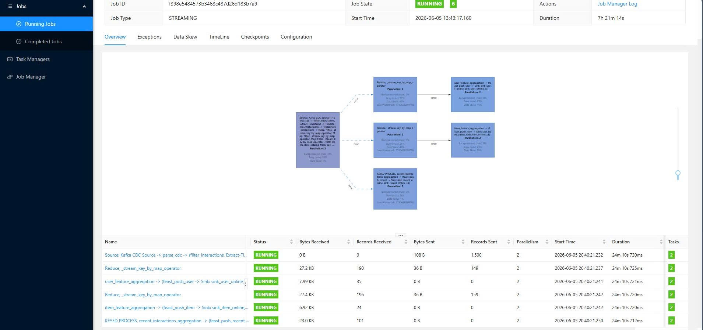
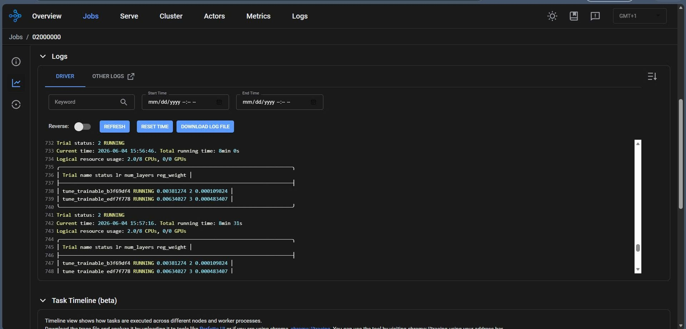
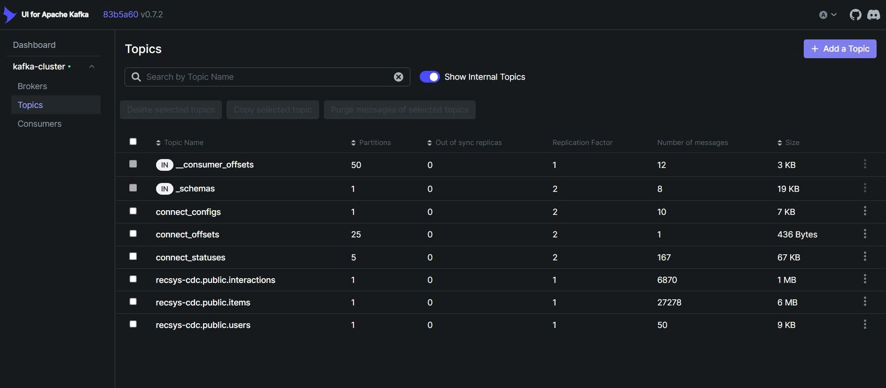
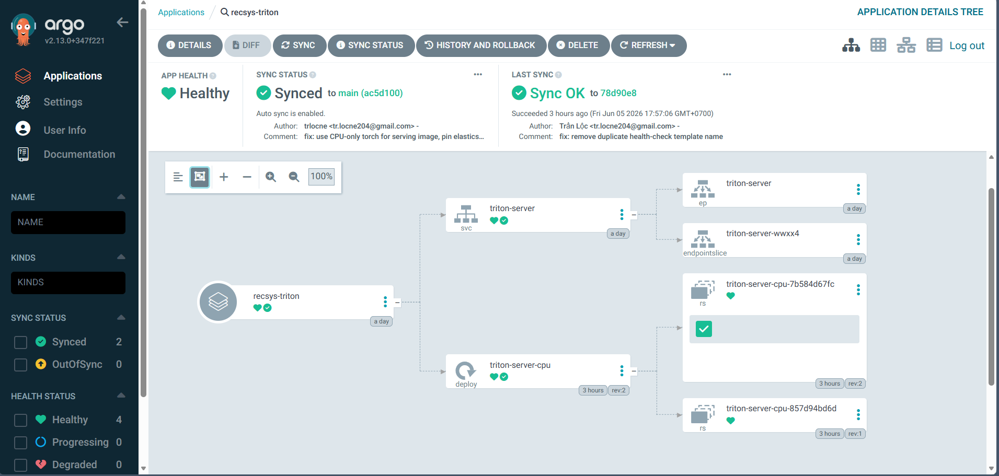

# RecSys — End-to-End Movie Recommendation System

A production-ready movie recommendation system built on MovieLens: CDC ingestion → real-time feature store → GNN + reranker training → serving via FastAPI + Triton on Kubernetes.



---

## Tech Stack

| Layer | Technology |
|---|---|
| Orchestration | Argo Workflows, ArgoCD, KubeRay |
| Training | LightGCN + DeepFM (PyTorch, Ray Tune, AWS Glue) |
| Feature Store | Feast (offline: S3, online: Aiven Redis) |
| Model Registry | MLflow |
| Inference | Triton Inference Server (ONNX) |
| Vector Search | Milvus |
| Text Search | Elasticsearch |
| CDC | Debezium → Kafka (Strimzi KRaft) → Flink |
| Serving | FastAPI + Next.js |
| Monitoring | Prometheus + Grafana + Loki + Tempo + Alertmanager |
| Cloud | DigitalOcean Kubernetes, AWS S3, Aiven PostgreSQL/Redis |

---

## Namespaces

| Namespace | Contents |
|---|---|
| `argo` | Argo Workflows, KubeRay, WorkflowTemplates |
| `argocd` | ArgoCD GitOps controller |
| `serving` | FastAPI, Triton, recsys-ui |
| `mlflow` | MLflow server + Postgres |
| `infra` | Debezium, Elasticsearch, Flink, Milvus, Schema Registry |
| `kafka` | Strimzi Kafka cluster (KRaft) |
| `monitoring` | Prometheus, Grafana, Loki, Tempo, Alertmanager |

---

## Prerequisites

```bash
# Tools: kubectl, helm ≥3.12, argo CLI ≥3.5, argocd CLI ≥2.9, docker ≥24

export KUBECONFIG=deployments/k8s/account/seanmovies-kubeconfig.yaml

helm repo add argoproj https://argoproj.github.io/argo-helm
helm repo add kuberay  https://ray-project.github.io/kuberay-helm/
helm repo add prometheus-community https://prometheus-community.github.io/helm-charts
helm repo add grafana  https://grafana.github.io/helm-charts
helm repo add strimzi  https://strimzi.io/charts/
helm repo update
```

---

## Secrets

```bash
kubectl create secret generic aws-creds \
  --from-literal=AWS_ACCESS_KEY_ID=<key> \
  --from-literal=AWS_SECRET_ACCESS_KEY=<secret> \
  --from-literal=AWS_DEFAULT_REGION=ap-southeast-1 \
  -n argo

kubectl create secret generic postgres-creds --from-literal=DB_PASSWORD=<pwd> -n mlflow
kubectl create secret generic postgres-creds --from-literal=DB_PASSWORD=<pwd> -n argo

kubectl create secret generic serving-db-creds \
  --from-literal=DATABASE_URL="postgresql://avnadmin:<pwd>@pg-30130064-seanhcmut05.c.aivencloud.com:27400/defaultdb?sslmode=require" \
  -n serving

kubectl create secret generic serving-redis-creds --from-literal=REDIS_URL=<url> -n serving
kubectl create secret generic slack-webhook --from-literal=url=<url> -n monitoring
kubectl create secret generic monitoring-creds \
  --from-literal=grafana-api-key=<token> \
  --from-literal=slack-webhook-url=<url> \
  -n argo
```

---

## Bootstrap

```bash
# Namespaces + RBAC
kubectl apply -f deployments/k8s/namespaces/namespaces.yaml
kubectl apply -f deployments/k8s/rbac/

# ArgoCD
kubectl create namespace argocd
kubectl apply -n argocd -f https://raw.githubusercontent.com/argoproj/argo-cd/v3.4.3/manifests/install.yaml

# GitOps root app — manages everything else automatically
kubectl apply -f deployments/argocd/root-app.yaml -n argocd

# WorkflowTemplates
kubectl apply -f cicd/argo/template/ -n argo
```

---

## Flink Operator

```bash
cd flink-kubernetes-operator
kubectl apply -f helm/flink-kubernetes-operator/crds/
helm upgrade --install flink-kubernetes-operator helm/flink-kubernetes-operator \
  --namespace flink-system --create-namespace --set webhook.create=false
```

---

## Data Infrastructure

```bash
# Kafka
kubectl apply -f 'https://strimzi.io/install/latest?namespace=kafka' -n kafka
kubectl apply -f deployments/k8s/infra/kafka/kafka-nodepool.yaml -n kafka
kubectl apply -f deployments/k8s/infra/kafka/kafka-cluster.yaml  -n kafka

# Debezium + Milvus + Elasticsearch + Flink
kubectl apply -f deployments/k8s/infra/debezium/  -n infra
kubectl apply -f deployments/k8s/infra/milvus/    -n infra
kubectl apply -f deployments/k8s/infra/elasticsearch/ -n infra
kubectl apply -f deployments/k8s/infra/flink-cluster/ -n infra

# Debezium connector
kubectl apply -f deployments/k8s/infra/debezium/debezium-connector-configmap.yaml -n infra
kubectl apply -f deployments/k8s/infra/debezium/debezium-connector-register-job.yaml -n infra
```

---

## Training Pipeline

```bash
argo submit cicd/argo/workflow/training-pipeline-submit-workflow.yaml \
  -n argo \
  -p registry=trlocne204 \
  -p num-epochs-gnn=10 \
  -p metric-threshold=0.08 \
  -p skip-tune=true \
  --watch
```

**DAG:** Feast retrieval → AWS Glue preprocess → data-prep → LightGCN (Ray) → Milvus index → DeepFM (Ray) → validate → promote → ONNX export → serving update

**Key params:** `skip-tune`, `num-epochs-gnn`, `metric-threshold`, `run-serving-update`, `registry`

---

## Serving Update

Daily at 2AM UTC via CronWorkflow. Manual trigger:

```bash
argo submit --from cronworkflow/serving-update-cron -n argo --watch
```

**Flow:** Feast materialize → GNN batch inference → Milvus blue-green swap → ES rebuild → Triton reload → rollout restart

---

## Serving API

```
GET  /v1/recommend/home?user_id=1          — personalized home feed
GET  /v1/recommend/item?item_id=1&user_id=1 — similar items
GET  /v1/recommend/search?q=action&user_id=1 — BM25 + reranking
POST /v1/feedback/click                    — record interaction
GET  /health | /metrics
```

---

## Port Forwards

```bash
kubectl port-forward svc/argo-server                   -n argo       2746:2746
kubectl port-forward svc/recsys-monitoring-grafana     -n monitoring 3000:80
kubectl port-forward svc/mlflow                        -n mlflow     5000:5000
kubectl port-forward svc/serving                       -n serving    8000:8000
kubectl port-forward svc/kafka-ui                      -n kafka      8080:8080
kubectl port-forward service/flink-cdc-ui              -n infra      8081:8081
```

---

## Secrets Reference

| Secret | Namespace | Contents |
|---|---|---|
| `aws-creds` | `mlflow`, `infra`, `argo` | AWS credentials |
| `postgres-creds` | `argo`, `mlflow` | `DB_PASSWORD` |
| `serving-db-creds` | `serving` | `DATABASE_URL` |
| `serving-redis-creds` | `serving` | `REDIS_URL` |
| `slack-webhook` | `monitoring` | Slack webhook URL |
| `monitoring-creds` | `argo` | Grafana API key + Slack URL |
| `debezium-connector-secret` | `infra` | Aiven PostgreSQL credentials |

---

## Assignment — Cloud Computing

### Flink CDC Job — Real-time Feature Ingestion



### Ray Tune — Distributed Hyperparameter Search



### Kafka Topics — CDC Event Streaming



### ArgoCD — GitOps Deployment


